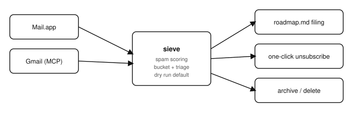

# sieve

  [](https://github.com/nulljosh/sieve)

An inbox fills up whether you look at it or not. Dev-tool alerts that actually need a fix. Newsletters you never asked twice for. Notification spam wearing a real sender's name. Sorting it by hand is the same ten minutes every day, spent the same way.

That's the gap.

## What it does

A Claude Code skill, not a server. Point it at your inbox and it reads every account headlessly — no UI, no screenshots — and puts each message in one of two piles.

Real alerts (App Store Connect, Vercel, Sentry, a failed GitHub Action) get the project matched, the actual error pulled from the log, and either fixed on the spot or filed to that project's roadmap. Junk gets scored — sender/domain mismatch, urgency language, obfuscated links, an unsubscribe header nobody asked for — and cleared: a real `List-Unsubscribe` one-click POST where the sender supports it (most do), archive or delete otherwise. Dry run first, always. Nothing gets touched until you say go.

## Why this and not a filter rule

A filter rule is static — it catches what you already know to catch. This reads the actual message, decides what kind of thing it is, and takes the next real step: file a bug, fix a build, or unsubscribe and move on. The difference between a spam folder and someone who actually reads your mail.

## Run it

This is a Claude Code skill, invoked from a session, not a hosted service:

```
/mail                 dry run — read, classify, report, touch nothing
/mail apply            real pass — file, fix, archive/delete, unsubscribe
```

Full triage logic, spam scoring, and unsubscribe handling: [SKILL.md](SKILL.md).

## Dashboard

Triage still only runs inside a Claude Code session — that part doesn't change. But every run logs its counts to [sieve.heyitsmejosh.com](https://sieve.heyitsmejosh.com), so there's a real history to check without opening a terminal: web, and native iOS/macOS apps that show the same page.

## Architecture


